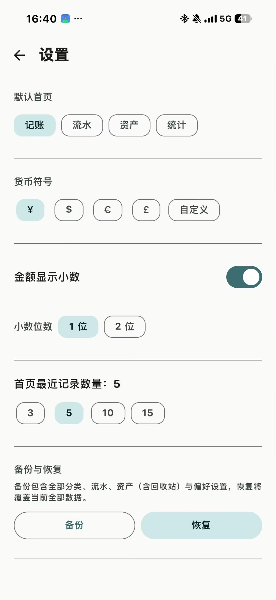
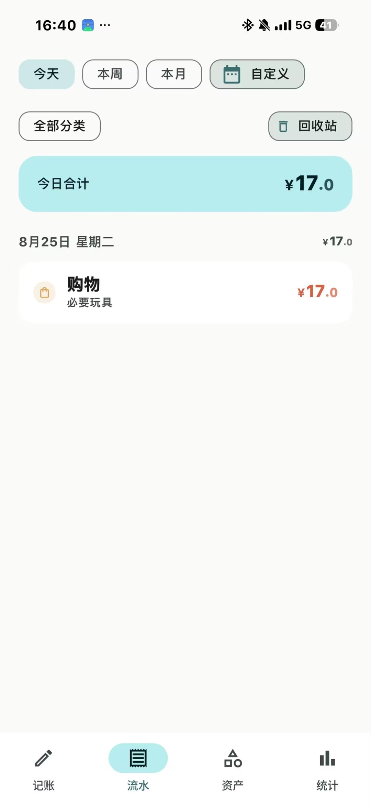
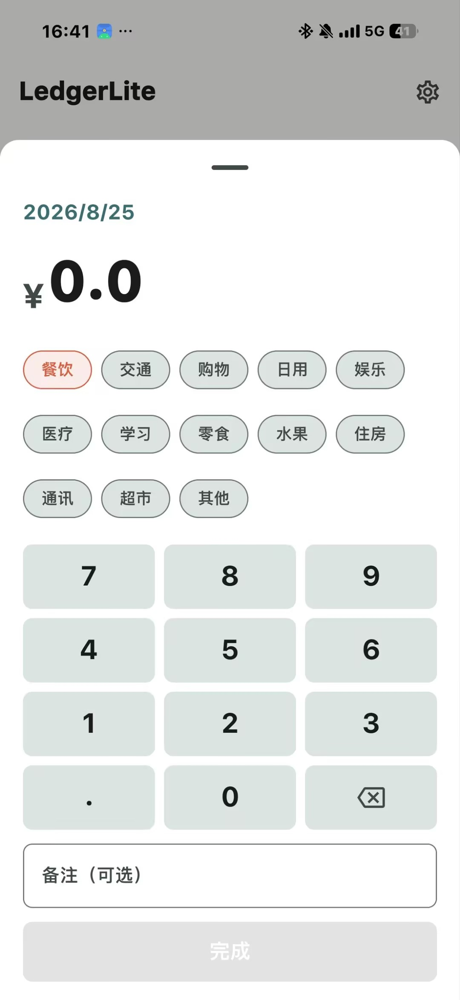
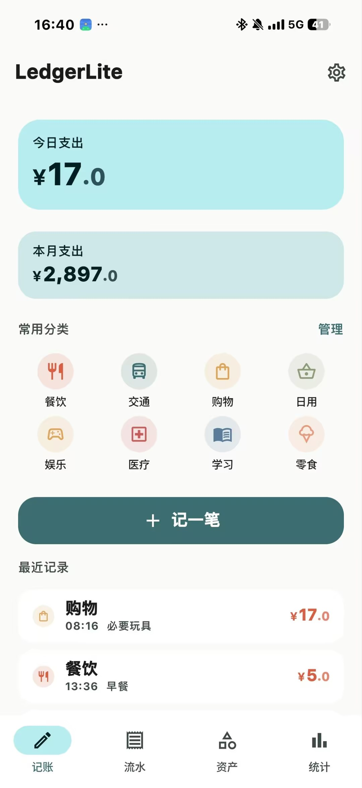
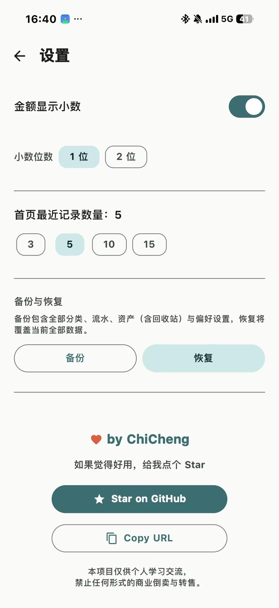

# 截图索引

v0.1.1 实机走查截图，对应设置页→关于对话框显示的当前版本。各图按页面分组，文件名即可读出场景。

## 记账

-  — **record-home.png**：今日/本月支出、常用分类、记一笔入口、最近记录
-  — **record-quick-entry.png**：点击「记一笔」或常用分类弹出的金额+键盘+分类选择面板

## 流水

-  — **ledger-list-with-trash.png**：时间筛选 + 分类筛选行对侧的回收站 chip 入口，按日分组的流水卡片

## 资产

-  — **bigitem-list.png**：当前使用成本汇总 + 单件资产日均/周均/已使用天数

## 统计

-  — **stats-category-pie.png**：本月合计 + 分类占比环形图
-  — **stats-trend-heatmap.png**：近 30 天支出趋势 + 近 12 周热力图 + 资产使用成本

## 设置

-  — **settings-top.png**：默认首页、货币符号、小数显示、最近记录数量
-  — **settings-bottom.png**：备份与恢复（新增）+ 作者 footer

> 这些图与 [v0.1.1 Release](https://github.com/ChiCheng-Chain/LedgerLite/releases/tag/v0.1.1) 中的资产是同一批；如需看高分辨率可到 Release 页下载原图。
